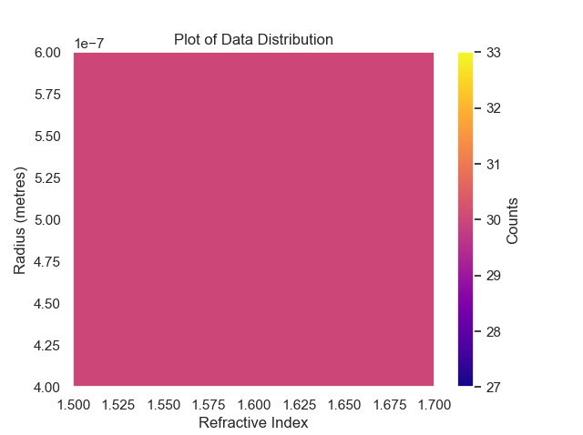
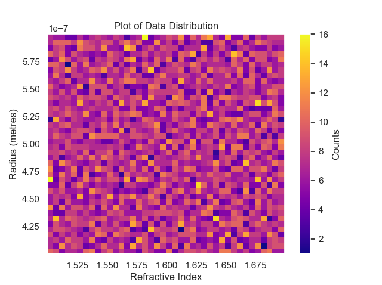
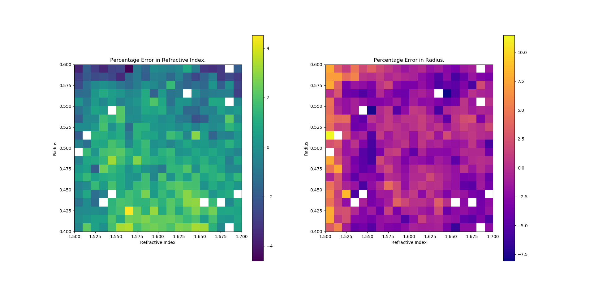
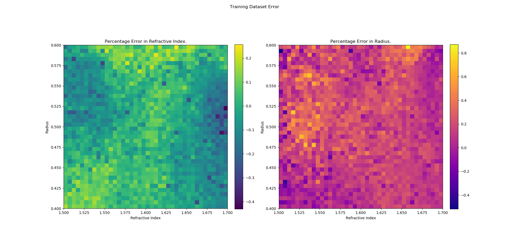
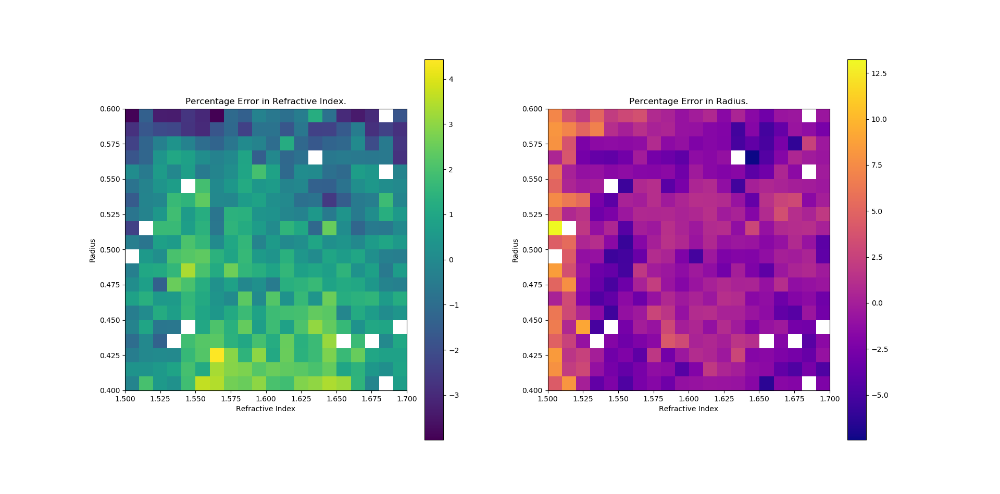
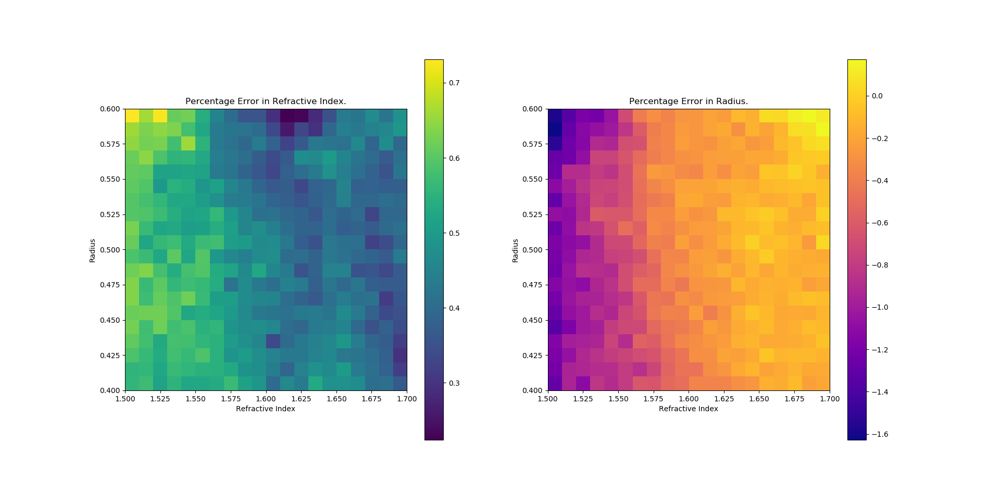

# Deep Regression for Properties of Particles in Optical Tweezers

## Intro
The ultimate goal of the project was to develop a neural network which can take force and position data from a particle trapped optical tweezers and predict the radius and refractive index of the particle. The problem is interesting because efficient computational methods exist (both conventional and machine learning based) that take in position, radius and refractive index and generate the forces on a particle accurately. This means it is possible to accurately simulate a trapped particle with a given refractive index and radius. No such efficient methods exist for the inverse problem, - that is taking in the 'behavior' of the trapped particle (e.g. in the form of forces and positions) to predict both the radius and refractive index. An efficient means to estimate the radius or refractive index of a given trapped particle could be of a lot of value to optical tweezers researchers. For example, by allowing fast categorization of unknown particles.

 The project involved simulation of data using a neural network, statistical analysis of the data, building and training models and assessing the performance of models.

## Method 

- A description of the model.
- Description of the times series approach.

### The Time Series Approach
In attempting to solve the inverse problem it was clear that more would be needed than unordered force data. It seemed apparent that any model for the data would need 'context' in order for there to be enough information. For example, a neural network that took in the force measured on a given axis would also need the position on that axis to 'orient' the model. It is hoped that for any given  

- Sampling of position vs. force
- Ax
- Breakthrough in using multiple force axes

### ResNet Model
It was decided from a review of time series classification literature (in particular using deep learning) [1] to use a ResNet classification Architecture. The architecture takes the highly successful image classification and modifies it to be used on time series data. The ResNet Architecture has several advantages:
- Deep network that can avoid the vanishing gradient problem.
- The best performance on the UCR Time Series Classifcation Dataset [1] among other leading time series classification architecture.
- Highly transferable: can use trained weights as initialisation for regression model or for pretraining an experimentally generated dataset.
- Can generate as much data as needed which suits a deep learning approach

## Data

### Simulation 

### Single Variable Data

- Data generation method and processing.
- Description of earlier methods and difference.
- Description of simulation

Moving to two dimensions introduces a dimensionality problem to the data generation. For example, in a single dimension 10000 uniformly distributed points would cover a unit length with a density of 100 points per 0.01 step. In two dimensions 10000 uniformly distributed points would cover a unit square with only 1 point per 0.01 square. This presents several problems for the old data generation process:
1. The low number of points per square means that less of the space of possible values will be available to the model.
2. Variance in the uniform distribution process will mean some squares will have no points and others will have more than average further reducing the coverage of the space. 

To solve these problems, several methods will be employed. 
1. Cutting down the space of refractive index and radii values to n=(1.5, 1.7), r = (0.4, 0.6) from n = (1.4, 1.7), r = (0.2, 0.8). This will help cut down on the raw number of points necessary to cover the space. Once a functioning model has been trained this space of points can be increased with transfer learning and simulation.
2. An increase in the raw number examples. At least 10000 points will be the baseline, number of points. From this baseline analysis of problematic points will allow targeted generation of training points over the problem spots. 
3. A move away from a full uniform distribution. Instead create a grid of tiles at a certain 'resolution' then sample points within the tiles. This will guarantee a certain resolution of uniform coverage. See image below for two plots of 12000 simulated points (10400 at 20 x 20 resolution, 1600 at 40 x 40). The first plot at a resolution of 20 x 20 and the second at 40 x 40. This new method implemented in the generate_2d_data function.

 

### Data Leakage Problem

Data leakage is the sharing of information from the validation or testing set to the training set. It is a problem because it can lead to over performance of the model on the supposedly 'unseen' training set. 

Specifically, the problem of data leakage appears in this case because the dataset is built up iteratively by increasing the sampling rate of specific problem areas. The distribution of the dataset is thus changing from iteration to iteration. This is a problem because in an earlier iteration of the method for predicting the value of a single variable the training and testing sets were simply obtained by splitting the dataset at some index (usually 90/10 training/testing). This naive method worked because samples in this case were drawn from one distribution (a uniform with set bounds) and so randomization was done at the data generation stages. 

If this same naive method was performed for the iterative data generation method then the training and testing sets will be from arbitrarily different distributions which is obviously problematic i.e. when taking the last 10% of the dataset for testing the last group of points generated will always be over represented in the testing set. A basic way to solve this problem would be to shuffle before generating the training and testing splits for each iteration of training to ensure that they are of the same distribution. However, if the weights are retained from a previous iteration this will result in examples from the previous training set ending up in the testing set, an over fitting problem.

Another data leakage problem occurred when z normalizing the data in the earlier iterations; the mean and standard deviation were taken from the entire set of samples collected i.e. both training and testing data. This means that information from the testing data was incorporated into the training data an obvious source of data leakage. 

These problems were fixed by a new implementation of the data generation and processing. Specifically, by building up the training and testing datasets at the same time but separately at the simulation stage. i.e. x% of the runs of the simulation are siphoned off to build up the testing data. Pre-processing of the data (including normalisation) then occurred on these separate datasets.  This ensured that the training and testing data are of the same distribution and that information from each dataset are not incorporated into the other.

## Results 
- Description of the results.
  - Error plots etc.

## Discussion
- Where to go from here.

# Part 1 - The Warmup: Classification of Radius adn Refractive Index Regression

## Classification Problem 

The aim of this part is to use force and/or positions data to classify a particle into 5 or 10 classes of radius evenly spaced from 0.2 $\mu m$ to 1 $\mu m$. A time series approach will be taken for this problem, that is the time ordering of the positions and forces will be preserved

The paper [1] compared several time series classification models on the UCR standard dataset. Based on the results from this paper the classification model will use a ResNet will be the basic model used 

This problem will serve as a proof of concept as well as a base to build on for extending the model. The weights that are computed can be used for transfer learning a base for a regression problem or for a base for classification of refractive index.

## The Data 
A neural network which has been trained to predict the forces on a particle given its position, radius and refractive index was used to simulate a spherical particle in an optical trap to generate training data. The simulation uses a time step of 10e-4 and generates the forces and positions for 1100 steps, the first 100 steps being discarded due to these points corresponding to the particle falling into the trap (hence only data where the particle was settled in the trap was used). Therefore each time series is 1000 point long correponding to 0.1 seconds in the trap.

## Regression Problem
Regression replaces the discrete classes from the classification problem with a continuously varying output space. This is a more general and realistic problem as on any practical application of the network there will not be the same set of 5 or 10 radii.
- How is it different to the classification problem
- Challenges

### Performance
The network was trained on a GPU which significantly sped up the process a

# Radii and Refractive Index Prediction

## Main model progress
- 200 Epochs.
  - Training on the 15000 point dataset. Test Error:

  - Training Error:

  
- 400 Epochs.
  - Test Error:

  - Training Error:

- In history plot there appears to be some overfitting going on.

# Summary 
- Got simulation working to generate some data using trained 5 degree of freedom model 
- Reading up on Neural Networks particularly convolutional neural networks and image classification.  
- Built a simple MLP model to help learn how keras works and how to process the generated data.
- Shifted reading focus to time series classification/regression.
- Reading leads to ResNet model and Deep learning. Begin process of building and training ResNet.
- Ran on GPU for huge speedup
- Running ResNet results in overfitting, more data is added.
    - Adding more data is not the most satisfying solution to overfitting 
- Why ResNet?
- Transfer learning from the 5 class to the ten resulted in 98.5% (best) validation accuracy within 20 epochs. 
    - Increased number of training points 
- Close to 0.1 starts getting dispersed positions.
- Changing radius appears to alter the equilibrium position.

# References
1. Deep learning for time series classification: a review (2019): https://arxiv.org/pdf/1809.04356.pdf

# Storage Documentation
## Data
### General Naming Scheme: 

(type)-data-(changing variable(s))-(simulation time)-(sampling rate)

### Examples
- cont-data-n-1-10: continuous data varying refractive index, one second simulation time with sampling rate of 10.
- disc6-data-r-01-1: discretely varying data of 6 classes varying radius, 0.1 second simulation time with sampling rate of 1.

## Models
### General Naming Scheme:

(model)-(label variable(s))-(type)-(axes)

### Examples
- resnet3-r-classify-xz: ResNet3 radius classification model on the xz axes.
- resnet3-nr-regression-xyz: ResNet3 radius and refractive index regression model run on the xyz axes.

## History file
For given model add -history.csv at the end.

# Progress
## 15/1/2020
- So far:
    - ResNet 5 and 10 class classifier working to 99% accuracy on the testing set.
    - Trained 1000 epoch model for the 5 class classifier.
    - Regression ResNet coded and tested on low epoch runs (100-200) including 10000 examples, seeing 10-15% MAPE and a gap between training and testing set. Probable overfitting.
- To do:
    - Tighten up the possible range for regression model.
    - Figure out the overfitting problem
        - y force axis, linear vs. circular polarisation and information correlation between x and y.
    - Tighten up simulation, aim to get a longer time window. Probably go with longer simulation and sampling a portion of the points.
      - Compare this with previous results
    - Heatmap or analysis of point that tend not to classified/regressed correctly.
    - Code for analysis of simulated data (eg. position plots, histograms etc.)
 
 ## 22/1/2020

- So far:
  - Spent last few days days tightening up the simulation
    - Add in the capacity for generating data with varying refractive index.
    - The simulation now stores values in the format (simulations, time series length, axes) and saves them as they go.
    - Add capacity for down-sampling the number of points generated to save on storage space as well as the length of time series passed to the model
  - Built functions for visualizing and summarizing the data generated but more can be done.
- To do:
  - Run some models on various ranges
  - Make network and data clean general (i.e. two dimensional)
  - Get some large datasets generated
  - Analyse the advantage of the longer simulation window.
  - Work on y axis and polarisation stuff.
  - Nail down radius and n ranges where well behaved.

## 28/1/2020 - email
Hey Lachlan,

I have some figures you can accuracy/loss plot figures you can use from training my ResNet time series model. I will give you a bit of background here so you can have some idea whether or not you want to include this stuff, we can talk in more detail if you want tomorrow. Also if you don't want to include any of this stuff that is fine too, it is totally up to you.

The basic idea was to generate 5000 force time series, each 1000 long and with 3 force axes, corresponding to different refractive indices uniformly distributed from 1.4 to 1.75 and a constant radius of 0.6. The model is then fed the time series and spits out a continuous (regression) output targeting the refractive index that generated the time series. 

The first Image is of the validation loss, error and percentage error as model trains. The best it ended up getting over the 600 epochs was about ~0.75% error which I think is ok but can certainly get better with tweaking and more training. 

The second image is the error and percentage error by the refractive index, the aim is to see where 'problem' refractive indices are (i.e. ones that the model tends to miss). To me the distribution of errors over the value of refractive index looks fairly uniform so maybe not a lot of info to be gleaned. 

I am hoping to next work on regressing both radius and refractive index. This is where I will apply a lot of the fine tuning ideas that we have come up with. 

Regards,

Oscar Smee
Images: regression_n_loss_accuracy, regression_n_accuracyvsn

## 29/1/2020
- So Far:
  - Happy with performance for 600 epochs on refractive index regression. Ready to move onto full generality of model where I think a lot of the ideas about overfitting/tightening up the models can be applied. 
  - Adding in y axis forces has very little cost in time and seems to help with over fitting
- To do:
  - Create heatmap/3d plots of std and correlations
  - Figure out combinations of valid values.
  - Generate dataset iteratively
  
  - Generate heatmap to diagnose 
  - Read about multiple outputs
  - Breakdown error by variable and by validation and testing.
  

## 5/2/2020
- So far:
  - Smarter method of simulating points, perhaps sampling within a non random grid to ensure there is enough coverage of parameter space or making less likely to generate a point close to other points.
  - Training and testing separated at the simulation stage. 
  - Some tools for visualizing the data
- To do:
  - Smarter sampling of the training and testing sets?
  - Iterative point generation needs to work with testing and training sets.
  - Fix data leakage by rewriting the data generation and processing functions.