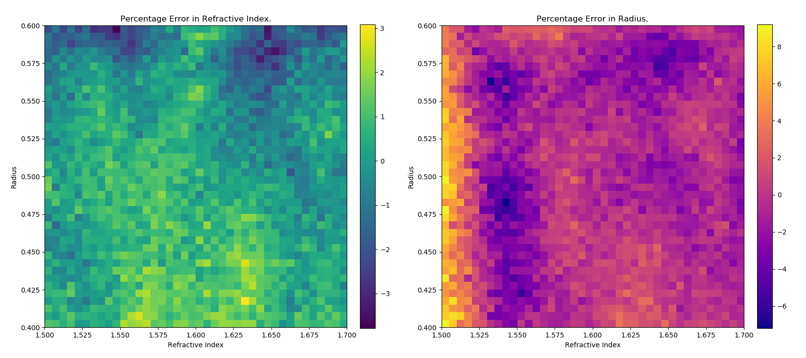

# Deep Regression for Properties of Particles in Optical Tweezers

## What I learned

I have learnt an immense amount over the course of the project both practically and in 'soft skills' such as:
- Spending dedicated time everyday working on a fairly opened and self directed ended project has taught me a lot about being resourceful. Often I would be completely lost on how to proceed and spent hours searching for a starting place. The volume of new machine learning papers is very high so I found that having a flow from high level summary at stack exchange and other forum posts as well as direction from the supervisor very important to obtain direction and find specific papers and articles that were critical reading. 
- I learned a lot about practical implementation of keras models, proper data generation, processing and storage techniques and choosing hyperparameters.  
- I learnt a lot about how to design a good workflow for modelling. Specifically, I found out how important it is to have a good idea of the *data generation -> data processing -> model training -> model output and analysis* pipeline before beginning the implementation. A lot of time on my project was spent recoding old systems that I had thrown together without knowing exactly where I was heading. If I had a good idea of my objectives and how I planned to implement from the start then I think I could have saved a lot time rewriting this code.
- Working well as a team. Working together with group partners and the supervisor was super important to me. I found group partners, even if they were working on different approaches to the problem were very important to bounce ideas off of and get feedback. The supervisor was very important for giving direction and narrowing down which avenues were most important to pursue. 
- Explaining the project at a variety of people at different knowledge levels (supervisors, group members, family and friends) helped me better understand how to communicate scientific/technical concepts.

The project involved simulation of data using a neural network, statistical analysis of the data, building and training models and assessing the performance of models.

## Introduction to the problem

- Optical Tweezers.

The ultimate goal of the project was to develop a neural network which can take force and position data from a trapped and predict the radius and refractive index of the particle. The project is building off previous work by the supervisor (Isaac Lenton) in which a 5 degree of freedom fully connected neural network used $(x,y,z)$ position, radius and refractive index to predict the forces on a spherical particle. This network allows simulation of the motion of the particle much faster than that of analytical methods.

An efficient means to estimate the radius or refractive index of a given trapped particle could be of a lot of value to optical tweezers researchers. For example, by allowing fast categorization of unknown particles or by allowing measurement of the properties of  difficult to measure particles just by their motion.

## Method 

- A description of the model.
- Description of the times series approach.

### The Time Series Approach

In attempting to predict the properties of the particle I thought it would be valuable to capture the dynamics of the particle behavior in the data being fed to the model. A natural way of encoding the extra dynamic information into the data is preserve the time ordering of data. That is, instead of feeding the model a list of unordered values or histograms and other statistical summaries of the the data, a whole time series of values could be used for each radius and refractive index. This would allow the model to observe how different radius and refractive index values affect the behaviour of the particle dynamically over time rather than just at a point. I have also had some experience working with time series data and thought it could be a good way to differentiate my project from previous work and the work of other group members.

For practical reasons (with the current experimental setup force data can be captured at a far higher rate than position data) I decided to focus on using just force data in the x, y and z axes.

- Sampling of position vs. force
- Ax
- Breakthrough in using multiple force axes

### ResNet Model
An advantage of taking a time series approach is that allows utilization of some highly flexible and efficient times series classification/regression models. These models are based on recent breakthroughs in image classification. In image classification/regression problems the model is trained to analyse images to categorize them into classes (for example the type of animal in a picture), in the case of classification or into a single or multiple continuous outputs (for example predicting a house price from an image), as in the case of regression. Image classification/regression is a surprisingly similar problem to time series classification/regression as fundamentally an image (at least a grey scale image), to a computer, is a two dimensional (matrix) collection of ordered values whereas a time series is simple a one dimensional collection of ordered values. This similarity between the two problems means that a lot of the techniques for image classification/regression carry over to time series classification/regression. 

A key class of models for the image classification models are Convolutional Neural Networks (CNN). These models are based around the operation of convolution, whereby a multiple small square filter (3x3 for example) are 'slid' along the image (matrix) computing the dot product at each stage and outputting that value to a new matrix. 

It was decided from a review of time series classification literature (in particular using deep learning) [1] to use a ResNet classification Architecture. The architecture takes the highly successful image classification and modifies it to be used on time series data. The ResNet Architecture has several advantages:
- Deep network that can avoid the vanishing gradient problem.
- The best performance on the UCR Time Series Classifcation Dataset [1] among other leading time series classification architecture.
- Highly transferable: can use trained weights as initialisation for regression model or for pretraining an experimentally generated dataset.
- Can generate as much data as needed which suits a deep learning approach

### Performance
The network was trained on a GPU which significantly sped up the process a

## Data

### Simulation 

To generate enough training data a simulation method was used rather than physically measuring data from trapped particles. The data was simulated using the previously mentioned 5 degree of freedom (5-DOF) fully connected neural network which takes in $(x,y,z)$ position, radius and refractive index and outputs forces. This network had been trained on a range of radii from ~0.1-1 micron and a range of refractive indices ~1.4-2. 

The simulation worked by computing the positions and forces of the particle in discrete time steps. The particle was initialized at the origin and 
at each time step the $(x,y,z)$ position of the particle was inputted into the 5-DOF network which outputted the value of the deterministic forces due to the trap in each direction $(f_x, f_y, f_z)$. The particles are sufficiently small that a brownian motion term from thermal agitation also had to be added to the deterministic forces. Following [2], these forces are used to compute the new position of the particle.

Once the simulation of the motion of the particle was complete the positions were plotted to ensure that the expected trapping behaviour was occurring (radii and refractive indices that were too close to the boundary of the range of values the 5-DOF network was trained on did not trap properly) and it was found that a time step of $10^{-4}$ was sufficiently small to observe the expected trapping behaviour without excessively small steps. It was also noticed in these plots that the trap centre was not always located at the origin and hence the first 50 or so time steps were made up of the particle 'falling' into the trap. For this reason it was decided that first hundred points of each simulation would be removed to ensure only 'regular' trapped behaviour would be included.

The simulation for each particle was run for 0.1 seconds which, with a time step of $10^{-4}$, meant 1000 points in the time series for each axis. The simulation could have be run for longer to include more of the 'tail end' particle behaviour at the cost of having more points in each time series and increasing simulation time per particle. The amount of points in each time series can be reduced by sampling only a portion of the points generated e.g. run a 1 second simulation generating 10000 points and sample 1 point in 10 for a total of 1000 points at the cost of missing perhaps finer behaviour of the particle (how much this matters depends on how strong noise is compared to deterministic behaviour). This method was attempted but it was found that there was very little benefit to accuracy for a large increase in simulation times. It was thought that it would be better, especially when changing both radius and refractive index to have a larger amount of particles simulated for a shorter amount of time.

### Single Variable Data

The

- Data generation method and processing.
- Description of earlier methods and difference.
- Description of simulation

Moving to two dimensions introduces a dimensionality problem to the data generation. For example, in a single dimension 10000 uniformly distributed points would cover a unit length with a density of 100 points per 0.01 step. In two dimensions 10000 uniformly distributed points would cover a unit square with only 1 point per 0.01 square. This presents several problems for the old data generation process:
1. The low number of points per square means that less of the space of possible values will be available to the model.
2. Variance in the uniform distribution process will mean some squares will have no points and others will have more than average further reducing the coverage of the space. 

To solve these problems, several methods will be employed. 
1. Cutting down the space of refractive index and radii values to n=(1.5, 1.7), r = (0.4, 0.6) from n = (1.4, 1.7), r = (0.2, 0.8). This will help cut down on the raw number of points necessary to cover the space. Once a functioning model has been trained this space of points can be increased with transfer learning and simulation.
2. An increase in the raw number examples. At least 10000 points will be the baseline, number of points. From this baseline analysis of problematic points will allow targeted generation of training points over the problem spots. 
3. A move away from a full uniform distribution. Instead create a grid of tiles at a certain 'resolution' then sample points within the tiles. This will guarantee a certain resolution of uniform coverage. See image below for two plots of 12000 simulated points (10400 at 20 x 20 resolution, 1600 at 40 x 40). The first plot at a resolution of 20 x 20 and the second at 40 x 40. This new method implemented in the generate_2d_data function.

 

### Data Leakage Problem

Data leakage is the sharing of information from the validation or testing set to the training set. It is a problem because it can lead to over performance of the model on the supposedly 'unseen' training set. 

Specifically, the problem of data leakage appears in this case because the dataset is built up iteratively by increasing the sampling rate of specific problem areas. The distribution of the dataset is thus changing from iteration to iteration. This is a problem because in an earlier iteration of the method for predicting the value of a single variable the training and testing sets were simply obtained by splitting the dataset at some index (usually 90/10 training/testing). This naive method worked because samples in this case were drawn from one distribution (a uniform with set bounds) and so randomization was done at the data generation stages. 

If this same naive method was performed for the iterative data generation method then the training and testing sets will be from arbitrarily different distributions which is obviously problematic i.e. when taking the last 10% of the dataset for testing the last group of points generated will always be over represented in the testing set. A basic way to solve this problem would be to shuffle before generating the training and testing splits for each iteration of training to ensure that they are of the same distribution. However, if the weights are retained from a previous iteration this will result in examples from the previous training set ending up in the testing set, an over fitting problem.

Another data leakage problem occurred when z normalizing the data in the earlier iterations; the mean and standard deviation were taken from the entire set of samples collected i.e. both training and testing data. This means that information from the testing data was incorporated into the training data an obvious source of data leakage. 

These problems were fixed by a new implementation of the data generation and processing. Specifically, by building up the training and testing datasets at the same time but separately at the simulation stage. i.e. x% of the runs of the simulation are siphoned off to build up the testing data. Pre-processing of the data (including normalisation) then occurred on these separate datasets.  This ensured that the training and testing data are of the same distribution and that information from each dataset are not incorporated into the other.

## Results 
- Description of the results.
  - Error plots etc.

To help with 

The model was trained for 100 epochs on 15000 points distributed in a 40 by 40 grid (see data section for details) covering the whole dataset. The error from this training was then inspected to diagnose 'problem' areas. In these areas more points will be added.

The first of the problem areas is the large error 'bar' in the region of n = (1.5, 1.525) and r = (0.4, 0.6) of the radius error plot. 2000 points were added spread over this region in a 5 by 40 grid. The next is the spot of high error in both plots at n = (1.625, 1.675) and r = (0.560, 0.6), 1000 points were distributed to this area in a 10 by 8 grid. Next are the areas of error in radius of the regions n = (1.530, 1.560) and r = (0.465, 0.500) and r = (0.545, 0.575). 1000 points were added to each of these regions in a grid of 6 by 7 and 6 by 6 respectively. 

So on so on

Ran a 500 epoch train and saw significant overfitting. Double the number of points and re run

## Discussion
- Where to go from here.
  - Experimental data
  - Longer simulations.
  - Multiple runs and averaging performance.
  - 

# Radii and Refractive Index Prediction

## Main model progress

# Summary 
- Got simulation working to generate some data using trained 5 degree of freedom model 
- Reading up on Neural Networks particularly convolutional neural networks and image classification.  
- Built a simple MLP model to help learn how keras works and how to process the generated data.
- Shifted reading focus to time series classification/regression.
- Reading leads to ResNet model and Deep learning. Begin process of building and training ResNet.
- Ran on GPU for huge speedup
- Running ResNet results in overfitting, more data is added.
    - Adding more data is not the most satisfying solution to overfitting 
- Why ResNet?
- Transfer learning from the 5 class to the ten resulted in 98.5% (best) validation accuracy within 20 epochs. 
    - Increased number of training points 
- Close to 0.1 starts getting dispersed positions.
- Changing radius appears to alter the equilibrium position.

# References
1. Deep learning for time series classification: a review (2019): https://arxiv.org/pdf/1809.04356.pdf
2. Simulation of a Brownian particle in an optical trap (2013): https://aapt-scitation-org.ezproxy.library.uq.edu.au/doi/full/10.1119/1.4772632

# Storage Documentation
## Data
### General Naming Scheme: 

(type)-data-(changing variable(s))-(simulation time)-(sampling rate)

### Examples
- cont-data-n-1-10: continuous data varying refractive index, one second simulation time with sampling rate of 10.
- disc6-data-r-01-1: discretely varying data of 6 classes varying radius, 0.1 second simulation time with sampling rate of 1.

## Models
### General Naming Scheme:

(model)-(label variable(s))-(type)-(axes)

### Examples
- resnet3-r-classify-xz: ResNet3 radius classification model on the xz axes.
- resnet3-nr-regression-xyz: ResNet3 radius and refractive index regression model run on the xyz axes.

## History file
For given model add -history.csv at the end.

# Progress
## 15/1/2020
- So far:
    - ResNet 5 and 10 class classifier working to 99% accuracy on the testing set.
    - Trained 1000 epoch model for the 5 class classifier.
    - Regression ResNet coded and tested on low epoch runs (100-200) including 10000 examples, seeing 10-15% MAPE and a gap between training and testing set. Probable overfitting.
- To do:
    - Tighten up the possible range for regression model.
    - Figure out the overfitting problem
        - y force axis, linear vs. circular polarisation and information correlation between x and y.
    - Tighten up simulation, aim to get a longer time window. Probably go with longer simulation and sampling a portion of the points.
      - Compare this with previous results
    - Heatmap or analysis of point that tend not to classified/regressed correctly.
    - Code for analysis of simulated data (eg. position plots, histograms etc.)
 
 ## 22/1/2020

- So far:
  - Spent last few days days tightening up the simulation
    - Add in the capacity for generating data with varying refractive index.
    - The simulation now stores values in the format (simulations, time series length, axes) and saves them as they go.
    - Add capacity for down-sampling the number of points generated to save on storage space as well as the length of time series passed to the model
  - Built functions for visualizing and summarizing the data generated but more can be done.
- To do:
  - Run some models on various ranges
  - Make network and data clean general (i.e. two dimensional)
  - Get some large datasets generated
  - Analyse the advantage of the longer simulation window.
  - Work on y axis and polarisation stuff.
  - Nail down radius and n ranges where well behaved.

## 28/1/2020 - email
Hey Lachlan,

I have some figures you can accuracy/loss plot figures you can use from training my ResNet time series model. I will give you a bit of background here so you can have some idea whether or not you want to include this stuff, we can talk in more detail if you want tomorrow. Also if you don't want to include any of this stuff that is fine too, it is totally up to you.

The basic idea was to generate 5000 force time series, each 1000 long and with 3 force axes, corresponding to different refractive indices uniformly distributed from 1.4 to 1.75 and a constant radius of 0.6. The model is then fed the time series and spits out a continuous (regression) output targeting the refractive index that generated the time series. 

The first Image is of the validation loss, error and percentage error as model trains. The best it ended up getting over the 600 epochs was about ~0.75% error which I think is ok but can certainly get better with tweaking and more training. 

The second image is the error and percentage error by the refractive index, the aim is to see where 'problem' refractive indices are (i.e. ones that the model tends to miss). To me the distribution of errors over the value of refractive index looks fairly uniform so maybe not a lot of info to be gleaned. 

I am hoping to next work on regressing both radius and refractive index. This is where I will apply a lot of the fine tuning ideas that we have come up with. 

Regards,

Oscar Smee
Images: regression_n_loss_accuracy, regression_n_accuracyvsn

## 29/1/2020
- So Far:
  - Happy with performance for 600 epochs on refractive index regression. Ready to move onto full generality of model where I think a lot of the ideas about overfitting/tightening up the models can be applied. 
  - Adding in y axis forces has very little cost in time and seems to help with over fitting
- To do:
  - Create heatmap/3d plots of std and correlations
  - Figure out combinations of valid values.
  - Generate dataset iteratively
  
  - Generate heatmap to diagnose 
  - Read about multiple outputs
  - Breakdown error by variable and by validation and testing.
  

## 5/2/2020
- So far:
  - Smarter method of simulating points, perhaps sampling within a non random grid to ensure there is enough coverage of parameter space or making less likely to generate a point close to other points.
  - Training and testing separated at the simulation stage. 
  - Some tools for visualizing the data
- To do:
  - Smarter sampling of the training and testing sets?
  - Iterative point generation needs to work with testing and training sets.
  - Fix data leakage by rewriting the data generation and processing functions.

## 12/2/2020
- So far:
  - Fixed data leak and completely reworked simulation and processing.
  - Fixed incorrect computation of gamma where hardcoded 'radius' was used instead of 'r' variable. 
  - Generated new 15000 point dataset and began training new network after mistakes were fixed.