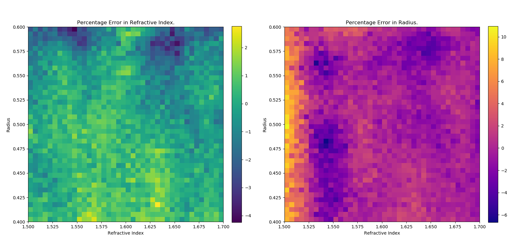
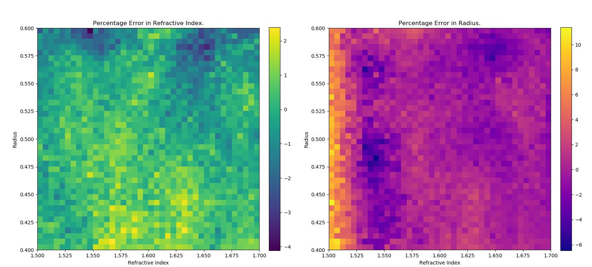
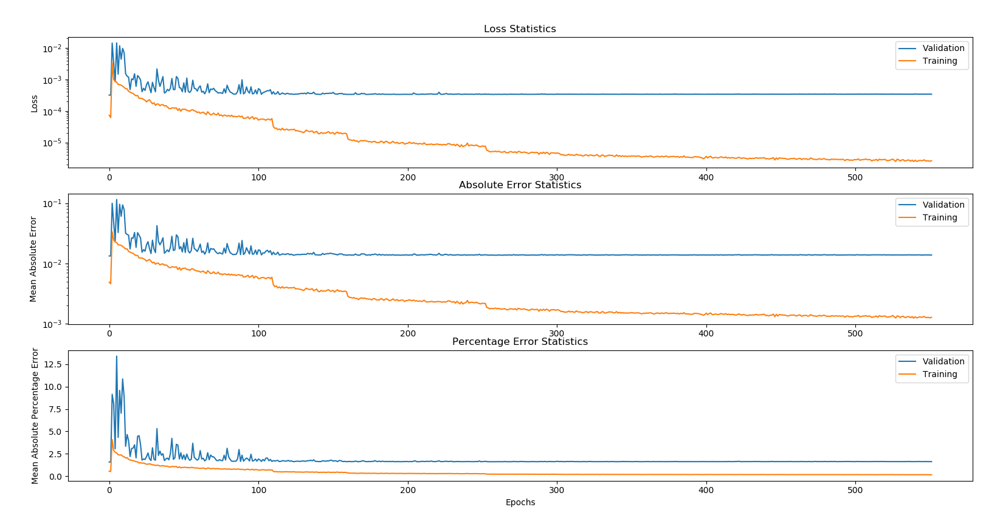

# Deep Learning of Properties of Particles in Optical Tweezers

## Summary

### What worked well?

I think that the time series classification/regression approach worked well and has a lot of potential. For regression of radius and refractive index my best validation mean absolute percentage errors are approaching ~1.6 and my absolute error is approaching ~0.013. I haven't really done any fiddling with the model so there is room for improvement by tweaking things like architecture or model depth to improve this result. The model weights are highly transferable too so I think there is potential for fine tuning on experimental data.

### What didn't work well?

Even on my best model runs there seems to be a lot of overfitting which probably means that there needs to be more architecture tweaking or I have hit a lower bound on useful information to be gleaned (I doubt this option). I also briefly tried using a Multi Layer Perceptron (MLP) on the force and position data and that didn't really seem to be very successful.

### What did I learn?

I have learnt an immense amount over the course of the project both practically and in 'soft skills' such as:

- Spending dedicated time everyday working on an open ended and self directed project has taught me a lot about being resourceful. There is a huge volume of machine learning papers coming out every single day so it was important to use summarising posts, work with advisors and sift efficiently throught material to obtain the highest value information.

- I learned a lot about practical implementation of keras models, proper data generation, processing and data storage techniques in pandas, keras and numpy. In particular, I leant a lot about modern neural networks like ResNet for both image and time series classification.

- I learnt a lot about how to design a good workflow for model building. Specifically, I found out how important it is to have a good idea of the: *data generation -> data processing -> model training -> model output and analysis* pipeline before beginning the implementation. A lot of time on my project was spent recoding old systems that I had thrown together without knowing exactly where I was heading. If I had a good idea of my objectives and how I planned to implement from the start then I think I could have saved a lot time rewriting this code.
  
- Working well as a team. Working together with group partners and the supervisor was super important to me. I found group partners, even if they were working on different approaches to the problem were very important to bounce ideas off of and get feedback. The supervisor was very important for feedback from, giving direction and narrowing down which avenues were most important to pursue.
  
- Explaining the project at a variety of people at different knowledge levels (supervisors, group members, family and friends) helped me better understand how to communicate scientific/technical concepts to people at different levels of understanding.

## Introduction to the problem

Optical tweezers are a poweful laser and microscope based method of trapping and manipulating very microscopic particles such as viruses, bacteria, micronewton scale particles and DNA [7]. They are capable of applying extremely precise forces (piconewton range) and very making precise measurements of positions (nanometre range). The precise means by which the optical tweezers function depends on the size of the particle relative to the wavelength of light. When the diameter of the particle is significantly larger than the wavelength of the light ray optics explains the behaviour.

||
|:--:|
|*Unfocused Optical Trap*|

|
|:--:|
|*Focused Optical Trap*|

(*Image Credit: Koebler, CC BY 3.0, unfocused: https://commons.wikimedia.org/w/index.php?curid=15083861, focused: https://commons.wikimedia.org/w/index.php?curid=15083883*)


The ultimate goal of the project was to develop a neural network which can take force and position data from a trapped and predict the radius and refractive index of the particle. The project is building off previous work by the supervisor (Isaac Lenton) in which a 5 degree of freedom fully connected neural network used $(x,y,z)$ position, radius and refractive index to predict the forces on a spherical particle. This network allows simulation of the motion of the particle much faster than that of analytical methods.

An efficient means to estimate the radius or refractive index of a given trapped particle could be of a lot of value to optical tweezers researchers. For example, by allowing fast categorization of unknown particles or by allowing measurement of the properties of  difficult to measure particles just by their motion.

## Method

### The Time Series Approach

In attempting to predict the properties of the particle I thought it would be valuable to capture the dynamics of the particle behavior in the data being fed to the model. A natural way of encoding the extra dynamic information into the data is preserve the time ordering of data. Instead of feeding the model a list of unordered values or histograms and other statistical summaries of the the data, a whole time series of values could be used for each radius and refractive index. This would allow the model to observe how different radius and refractive index values affect the behaviour of the particle dynamically over time rather than just at a point. I have also had some experience working with time series data and thought it could be a good way to differentiate my project from previous work and the work of other group members. For practical reasons (with the current experimental setup force data can be captured at a far higher rate and precision than position data) I decided to focus on using just force data in the x, y and z axes as this data would be most useful for practical applications.

### ResNet Model

An advantage of taking a time series approach is that allows utilization of some highly flexible and efficient times series classification/regression models which are based on recent breakthroughs in image classification. In image classification/regression problems the model is trained to analyse images in order to categorize them into classes (for example the type of animal in a picture) in the case of classification; or into a single or multiple continuous outputs (for example predicting a house price from an image) as in the case of regression. Image classification/regression is a surprisingly similar problem to time series classification/regression as fundamentally an image, to a computer, is a two dimensional (matrix) collection of ordered values whereas a time series is simply a one dimensional collection of ordered values. This similarity between the two problems means that a lot of the techniques for image classification/regression carry over to time series classification/regression.

A key class of models for the image classification models are Convolutional Neural Networks (CNN). These models are based around convolution layers, whereby a square of weighted values (5x5 for 25 total weights, for example) called a filter or kernel is 'slid' along the image (recall, just a matrix) computing the dot product at each stage between the weights of the filter and the values of the image passed over by the filter and outputting that value to a new matrix. There can be multiple such filters for each input that each capture a different aspect of the data and hence multiple output matrices for a given input matrix are possible.

||
|:--:|
| *Convolution Diagram* |

(*Input matrix in blue, filter is shading and output matrix is in cyan. Image from https://github.com/vdumoulin/conv_arithmetic*)

The values actually trained are the filter weights and these same filter weights are applied everywhere along an image we can think of the network training the filters to activate when distinguishing features are present regardless of their location in the image. An example is training a network to classify images into either being of dogs or zebras. We can think of our model using certain filters to activate, for example, when they detect stripes, paws or floppy ears as these are distinguishing features (just as an example, in all likelihood a CNN would not use those features), regardless of where they are located in the image. Convolutional neural networks are far more parsimonious, in that, so long as it doesn't matter so much where the distinguishing features are located as they can utilise information in every area of the image. Something like a fully connected neural network which has no sense of the space of the image and which tries to learn the image features in each location from scratch will require far more parameters to achieve the same results.

(*for reference and more reading on convolutional neural networks see [3]*)

For time series classification model we are no longer dealing with a a two dimensional image we swap square convolutions for rectangular with the width of the rectangle always being the same as the number of variables in the time series. For example, for a single variable time series we might choose a filter of 5 by 1 and for a k variable time series we could choose a 3 by k. The aim is still to slide this filter along the time series and train it to detect distinguishing features, for example, spikes of certain heights or areas with high or low variance.

(*See [4] for some illustration and examples.*)

CNNs are a broad class of models and choice of architecture can have a large influence on the predictive success of a model. The paper *Deep learning for time series classification: a review* [1] compares 9 deep learning architectures for the classification of time series over 97 standard time series classification datasets (the UCR time series archive) including a basic Multilayer Perceptron (MLP), a Fully Convolutional Network (FCN), a Residual Network (ResNet) and other convolutional and non convolutional networks. Each model was run 10 times and the results averaged together to reduce the importance of the random initialization. The winner of the competition for single variable time series was ResNet, followed by FCN. ResNet took the first place on 50 out of 85 tests. On multivariate FCN edged a win over ResNet but due to the small number of multivariate time series, the difference between the two was negligible.

On the basis of these tests it was decided to implement a ResNet time series classification model, specifically one similar to that used in the above tests. ResNet for time series classification is based on the highly successful ResNet for image classification. The ResNet model was introduced in 2015 and achieved a record error of 3.57% and first place in the 2015 ImageNet ILSVRC challenge, in which models compete to sort images into 1000 classes [5]. The refinements made in ResNet over previous convolutional networks were huge, just three years earlier AlexNet had popularized the convolutional approach with a record score of 16% error on the ImageNet, the closest runner up achieving 26% [3].

The time series classification ResNet (the one used in [1]) is based upon 3 residual blocks, each residual block being composed of 3 convolution blocks. A convolution block is composed of a convolution layer followed by a batch normalization layer and a ReLU activation layer. The batch normalization layer has been found to significantly stabilize and speed up training. All convolutional layers have 64 filters but within the first residual block and 128 in the final two. The first, second and third convolutional layers have a filter length of respectively 8, 5, and 3 within each residual block5. There is also a skip connection built into every residual block. That is the input from the start of the block is directly summed with the output of the 3 convolution blocks making up the residual block, this skip connection is what makes a Residual Network (ResNet). The purpose of the skip connections is to avoid the degradation in performance observed in deep neural networks. This degradation is counter intuitive as, theoretically, unnecessary additional layers could simply be trained to be the identity mapping, $F(x) = x$, without any change in performance. This depth problem is thought to be caused by difficulty in learning the identity mapping or close to the identity mapping. Residual connections fix the problem by letting the convolution blocks learn the residual rather than the full output; the desired total output of a residual block with a skip connection is $H(x) = F(x) + x$ where $H(x)$ is the true mapping and $F(x)$ is the output of the convolutional layers. From this we can see our convolutional layers now learn $R(x) = H(x) - x$, the residual. This appears to make it easier for deep models to learn the identity mapping (or close to identity) by setting $F(x) = 0$ [5]. After the three residual blocks there is a global average pooling layer which averages along the time dimension which is followed by the final fully connected softmax layer that serves as the output of the network.

So far we have discussed only a classification model, the model for this project needs to be capable of performing regression as well. In the paper *A Comprehensive Analysis of Deep Regression* [6] found that simply replacing the final softmax layer of the image classification networks ResNEt and VGG with a fully connected linearly activation layer lead to good results for image regression. Following this result, the model for this project will be modified for regression simply by replacing the softmax classification layer with a linear regression layer. It should be noted that the models in [6] were first trained on the ImageNet classification problem before being modified for regression, since there is no real 'standard' dataset for time series classification the ResNet model used will not be pretrained. As a modification to the current method undertaken here it would be possible to pretrain on a simpler classification problem i.e. sorting particles into discrete categories then switch out the classification layer for the regression layer.

The following is the model summary for the two output regression ResNet used in the final results. This model has 505,410 trainable parameters.

```
__________________________________________________________________________________________________
Layer (type)                    Output Shape         Param #     Connected to
==================================================================================================
input_1 (InputLayer)            (None, 1000, 3)      0
__________________________________________________________________________________________________
conv1d_1 (Conv1D)               (None, 1000, 64)     1600        input_1[0][0]
__________________________________________________________________________________________________
batch_normalization_1 (BatchNor (None, 1000, 64)     256         conv1d_1[0][0]
__________________________________________________________________________________________________
activation_1 (Activation)       (None, 1000, 64)     0           batch_normalization_1[0][0]
__________________________________________________________________________________________________
conv1d_2 (Conv1D)               (None, 1000, 64)     20544       activation_1[0][0]
__________________________________________________________________________________________________
batch_normalization_2 (BatchNor (None, 1000, 64)     256         conv1d_2[0][0]
__________________________________________________________________________________________________
activation_2 (Activation)       (None, 1000, 64)     0           batch_normalization_2[0][0]
__________________________________________________________________________________________________
conv1d_4 (Conv1D)               (None, 1000, 64)     256         input_1[0][0]
__________________________________________________________________________________________________
conv1d_3 (Conv1D)               (None, 1000, 64)     12352       activation_2[0][0]
__________________________________________________________________________________________________
batch_normalization_4 (BatchNor (None, 1000, 64)     256         conv1d_4[0][0]
__________________________________________________________________________________________________
batch_normalization_3 (BatchNor (None, 1000, 64)     256         conv1d_3[0][0]
__________________________________________________________________________________________________
add_1 (Add)                     (None, 1000, 64)     0           batch_normalization_4[0][0]
                                                                 batch_normalization_3[0][0]
__________________________________________________________________________________________________
activation_3 (Activation)       (None, 1000, 64)     0           add_1[0][0]
__________________________________________________________________________________________________
conv1d_5 (Conv1D)               (None, 1000, 128)    65664       activation_3[0][0]
__________________________________________________________________________________________________
batch_normalization_5 (BatchNor (None, 1000, 128)    512         conv1d_5[0][0]
__________________________________________________________________________________________________
activation_4 (Activation)       (None, 1000, 128)    0           batch_normalization_5[0][0]
__________________________________________________________________________________________________
conv1d_6 (Conv1D)               (None, 1000, 128)    82048       activation_4[0][0]
__________________________________________________________________________________________________
batch_normalization_6 (BatchNor (None, 1000, 128)    512         conv1d_6[0][0]
__________________________________________________________________________________________________
activation_5 (Activation)       (None, 1000, 128)    0           batch_normalization_6[0][0]
__________________________________________________________________________________________________
conv1d_8 (Conv1D)               (None, 1000, 128)    8320        activation_3[0][0]
__________________________________________________________________________________________________
conv1d_7 (Conv1D)               (None, 1000, 128)    49280       activation_5[0][0]
__________________________________________________________________________________________________
batch_normalization_8 (BatchNor (None, 1000, 128)    512         conv1d_8[0][0]
__________________________________________________________________________________________________
batch_normalization_7 (BatchNor (None, 1000, 128)    512         conv1d_7[0][0]
__________________________________________________________________________________________________
add_2 (Add)                     (None, 1000, 128)    0           batch_normalization_8[0][0]
                                                                 batch_normalization_7[0][0]
__________________________________________________________________________________________________
activation_6 (Activation)       (None, 1000, 128)    0           add_2[0][0]
__________________________________________________________________________________________________
conv1d_9 (Conv1D)               (None, 1000, 128)    131200      activation_6[0][0]
__________________________________________________________________________________________________
batch_normalization_9 (BatchNor (None, 1000, 128)    512         conv1d_9[0][0]
__________________________________________________________________________________________________
activation_7 (Activation)       (None, 1000, 128)    0           batch_normalization_9[0][0]
__________________________________________________________________________________________________
conv1d_10 (Conv1D)              (None, 1000, 128)    82048       activation_7[0][0]
__________________________________________________________________________________________________
batch_normalization_10 (BatchNo (None, 1000, 128)    512         conv1d_10[0][0]
__________________________________________________________________________________________________
activation_8 (Activation)       (None, 1000, 128)    0           batch_normalization_10[0][0]
__________________________________________________________________________________________________
conv1d_11 (Conv1D)              (None, 1000, 128)    49280       activation_8[0][0]
__________________________________________________________________________________________________
batch_normalization_12 (BatchNo (None, 1000, 128)    512         activation_6[0][0]
__________________________________________________________________________________________________
batch_normalization_11 (BatchNo (None, 1000, 128)    512         conv1d_11[0][0]
__________________________________________________________________________________________________
add_3 (Add)                     (None, 1000, 128)    0           batch_normalization_12[0][0]
                                                                 batch_normalization_11[0][0]
__________________________________________________________________________________________________
activation_9 (Activation)       (None, 1000, 128)    0           add_3[0][0]
__________________________________________________________________________________________________
global_average_pooling1d_1 (Glo (None, 128)          0           activation_9[0][0]
__________________________________________________________________________________________________
reg2 (Dense)                    (None, 2)            258         global_average_pooling1d_1[0][0]
==================================================================================================
Total params: 507,970
Trainable params: 505,410
Non-trainable params: 2,560
```

## Data

### Simulation

To generate enough training data a simulation method was used rather than physically measuring data from trapped particles. The data was simulated using the previously mentioned 5 degree of freedom (5-DOF) fully connected neural network which takes in $(x,y,z)$ position, radius and refractive index and outputs forces. This network had been trained on a range of radii from ~0.1-1 micron and a range of refractive indices ~1.4-2.

The simulation worked by computing the positions and forces of the particle in discrete time steps. The particle was initialized at the origin and at each time step the $(x,y,z)$ position of the particle was inputted into the 5-DOF network which outputted the value of the deterministic forces due to the trap in each direction $(f_x, f_y, f_z)$. The particles are sufficiently small that a brownian motion term from thermal agitation also had to be added to the deterministic forces. Following [2], these forces are used to compute the new position of the particle.

Once the simulation of the motion of the particle was complete the positions were plotted to ensure that the expected trapping behaviour was occurring (radii and refractive indices that were too close to the boundary of the range of values the 5-DOF network was trained on did not trap properly) and it was found that a time step of $10^{-4}$ was sufficiently small to observe the expected trapping behaviour without excessively small steps. It was also noticed in these plots that the trap centre was not always located at the origin and hence the first 50 or so time steps were made up of the particle 'falling' into the trap. For this reason it was decided that first hundred points of each simulation would be removed to ensure only 'regular' trapped behaviour would be included.

The simulation for each particle was run for 0.1 seconds which, with a time step of $10^{-4}$, meant 1000 points in the time series for each axis. The simulation could have be run for longer to include more of the 'tail end' particle behaviour at the cost of having more points in each time series and increasing simulation time per particle. The amount of points in each time series can be reduced by sampling only a portion of the points generated e.g. run a 1 second simulation generating 10000 points and sample 1 point in 10 for a total of 1000 points at the cost of missing perhaps finer behaviour of the particle (how much this matters depends on how strong noise is compared to deterministic behaviour). This method was attempted but it was found that there was very little benefit to accuracy for a large increase in simulation times. It was thought that it would be better, especially when changing both radius and refractive index to have a larger amount of particles simulated for a shorter amount of time.

The fact that the data varied in radius and refractive index introduced a dimensionality problem to the data generation. For example, in a single dimension 10000 uniformly distributed points would cover a unit length with a density of 100 points per 0.01 step. In two dimensions 10000 uniformly distributed points would cover a unit square with only 1 point per 0.01 square. This presents several problems for a naive uniform distribution data generation process (like that used in early single variable testing):

1. The low number of points per square means that less of the space of possible values will be covered by the data.

2. Variance in the uniform distribution process will mean some parts of the space will have very little coverage while others will be highly saturated.

To solve these problems, several methods were employed.

1. Cutting down the space of refractive index and radii values to n=(1.5, 1.7), r = (0.4, 0.6) from the full space of valid points. This will help cut down on the raw number of points necessary to cover the space. Once a functioning model has been trained this space of points can be increased easily with transfer learning and simulation.

2. An increase in the raw number of examples. At least 10000 points will be the baseline, number of points. It was also thought that analysis of problematic points will allow targeted generation of training points over areas where error is highest.

3. A move away from a fully uniform distribution. Instead a grid of tiles was created at a certain 'resolution' then points were sampled within the tiles. This will guarantee at that resolution uniform coverage. See image below for the plots of 15000 simulated points (10400 at 20 x 20 resolution, 1600 at 40 x 40). The first plot at a resolution of 20 x 20 and the second at 40 x 40. This new method implemented in the generate_2d_data function.

### Data Processing

After the data was simulated, it was processed into the tensor form expected by keras and each time series was z normalised, i.e. for each value in the time series the mean in time was subtracted and standard deviation in time divided. This z normalisation was done as a standard processing step to keep the data in the same form as the standard UCR time archive used in [1] for testing each of the time series classification models. Normalisation should help with the stability of the training process.

### Data Leakage Problem

Data leakage is the sharing of information from the validation or testing set to the training set. It is a problem because it can lead to over performance of the model on the supposedly 'unseen' training set.

The problem of data leakage appears in this case because the dataset is intented to be capable of being built up iteratively. The distribution of the dataset is thus changing from iteration to iteration. This is a problem because in an earlier iteration of the data generation process the training and testing sets were simply obtained by splitting the dataset at some index (usually 90/10 - training/testing). This naive method worked because samples in this case were drawn from one distribution (a uniform with set bounds) and so randomisation was done at the data generation stages.

If this same naive method was performed for the iterative data generation method then the training and testing sets will be from arbitrarily different distributions which is problematic i.e. when taking the last 10% of the dataset for testing the last group of points generated will always be over represented in the testing set. A basic way to solve this problem would be to shuffle before generating the training and testing splits for each iteration of training to ensure that they are of the same distribution. However, if the weights are retained from a previous iteration this will result in examples from the previous training set ending up in the testing set, a data leakage.

To avoid this and any other data leakage problem, it was decided to build up the training and testing datasets at the same time but separately at the simulation stage. i.e. 10% of the runs of the simulation are siphoned off to build up the testing data. Processing of the data (including normalization) then occurred on these separate datasets. This ensured that the training and testing data are of the same distribution and that information from each dataset are not incorporated into the other.

### The Datasets

The following plots were generated to show the distribution of the largest dataset generated, with 30000 points distributed over a 40x40 grid.

|  |
|:--:|
| *Plot of Training Set 40 by 40 Grid* |

| |
|:--:|
| *Plot of Testing Set 40 by 40 Grid* |

Note how at places where there are less points in the training set there are more in the testing set. This is because the testing set was formed from taking a tenth of the points in the training set, the two datasets together would be very close to uniform.

Also generated was a separate 'validation' dataset made up of 10000 points distributed in a 40 by 40 grid. This dataset will provide an evenly covered dataset for obtaining accurate error plots and estimates (testing dataset is too small to cover a detailed error plot).

|  |
|:--:|
| *Plot of Validation Set 40 by 40 Grid* |

Coverage is very even in the validation dataset because no points are taken for use in a testing set.

## Results

### Preliminary Testing and Iterative Generation

The first step was to do some short preliminary runs and test the iterative method for building up the dataset. The base dataset 15000 points distributed in a 40 by 40 grid (see data section for details) covering the space $n = (1.5, 1.7)$ and $r = (0.4, 0.6)$. A preliminary model (model A) was trained for 100 epochs on this dataset as a baseline. The error from this training was then inspected to diagnose 'problem' areas. In these areas more points will be added. The results of this run are shown below:

|  |
|:--:|
| *Plot of Validation Error Model A* |

(*Note: the 2d error plots display the average error for each point in the 40 by 40 grid.*)

The first of the problem areas is the large error 'bar' in the region of n = (1.5, 1.525) and r = (0.4, 0.6) of the radius error plot. 2000 points were added spread over this region in a 5 by 40 grid. The next is the spot of high error in both plots at n = (1.625, 1.675) and r = (0.560, 0.6), 1000 points were distributed to this area in a 10 by 8 grid. Next are the areas of error in radius of the regions n = (1.530, 1.560) and r = (0.465, 0.500) and r = (0.545, 0.575). 1000 points were added to each of these regions in a grid of 6 by 7 and 6 by 6 respectively.

After building up this augmented dataset it was tested in two ways: 1. by running 100 further epochs on the new dataset (Model B) 2. By starting again and repeating the first 100 epochs fresh on the new dataset (Model C). The error plot for models B and C are shown below as well as a table final validation stats for each model:
|  |
|:--:|
| *Plot of Validation Error Model B* |

|  |
|:--:|
| *Plot of Validation Error Model C* |

| Model | Loss on Validation | MAE on Validation | MAPE on Validation |
|:---:|:---:|:---:| :---: |
| A | 0.0004 | 0.0152 | 1.7849 |
| B | 0.0004 | 0.0145 | 1.7013 |
| C | 0.0006 | 0.0192 | 2.1639 |

Two caveats should be made about the final statistics 1. Selecting for more difficult points to be included in the dataset will necessarily raise error. 2. Initialization of A and C are random so results will vary even without differences in the datasets.

The changes in the error in the areas where more points were added from model A to model B are small, with maybe some slight dimming of error over the regions n = (1.530, 1.560) and r = (0.465, 0.500) and r = (0.545, 0.575). However, the overall validation error significantly decreases in the 100 extra epochs of training which suggests that there could be some value in the iterative generation method. On the other hand, error over problem spots in model C seemed to increase as well as the overall error but this is could be due to a poor random initialization of the model. Overall the iterative data generation method appeared to have potential and it seemed worthwhile to include it in further testing with longer training times.

### Full Runs

The next stage was running a longer 500 epoch train  on the 15000 point dataset. The error plots on the validation and training sets and training statistic diagnostics over time are shown below. The validation loss at 500 epochs was 0.0004 and the validation mean absolute percentage error was 1.745.

|  |
|:--:|
| *Plot of Validation Error 15000 Points, 500 Epochs of Training* |

| |
|:--:|
| *Diagnostic Plot 15000 Points, 500 Epochs of Training* |

The results of the 500 epoch train did not show a huge amount of progress in validation error and validation loss from the 100 epoch preliminary run. The main difference from the first 100 epochs which could be seen in validation set in the diagnostics plot is a 'flattening out' in the loss and errors over time. In the training set, on the other hand, loss and error are continually decreasing, sometimes in large jumps. This suggested an overfitting problem, that is, the model is simply starting learn the training set rather than the underlying relationship in the data. Learning the training set in this way is not improving model performance in a general setting as the particulars of the training set will not carry over to other unseen datasets.

A simple way to overcome the overfitting problem is to increase the size of the training set. Hence the next two full runs will be on the 20000 point targeted dataset generated in preliminary testing and a 30000 point 40 by 40 grid dataset (essentially a doubling the 15000 point dataset). The error plots and diagnostic plots as well as a comparison table of the model trained on each dataset are shown below. (*Note: the 30000 point model ran for ~50 epochs too long due to user error so epochs for 20000 point model were increased by 50*).

|  |
|:--:|
| *Plot of Validation Error 20000 Targeted Points, 500 Epochs of Training* |

|  |
|:--:|
| *Plot of Validation Error 30000 Points, 500 Epochs of Training* |

|  |
|:--:|
| *Plot of Diagnostics 20000 Points, 500 Epochs of Training* |


| |
|:--:|
| *Diagnostic Plot 30000 Points, 500 Epochs of Training* |

| Model | Validation Loss | Validation MAE | Validation MAPE|
|:--:| :---: | :---: | :---: |
| 15000 Points | 0.0004 | 0.0150 | 1.7645 |
| 20000 Points, Targeted | 0.0004 | 0.0145 | 1.6917 | 
| 30000 Points | 0.0003 | 0.0138 | 1.6312 |


Training on the larger datasets lowered validation loss and error; however, the gap between performance on the training and validation sets showed that overfitting was a significant problem in these larger datasets. It also seemed that changes to validation error from the larger dataset were becoming more marginal i.e. a doubling of the dataset size resulted in only a drop of 0.13 percentage points in validation error. The model's performance 20000 point dataset is more impressive from an efficiency perspective, achieving a drop of ~0.7 percentage points for only 5000 more points. 

Inspecting The 20000 point dataset error plot, it does not visually appear that error is particularly lower over the areas targeted with extra points in comparison to the 30000 point dataset or even the 15000 point dataset. This does not imply that there is no value in targeting points high error areas, simply that the change cannot be seen visually; there likely is some difference which explains the change in error.

## Where to go from here.

The effects of increased dataset size becoming more marginal and the fact overfitting is still a problem suggests that there is probably not much value in expanding the training dataset further, particularly if the model is going to be fine tuned on a much smaller experimental dataset at some point. Instead the model needs to be made more robust to overfitting through tweaks in architecture like dropout and other regularisation or even trying another high performing time series classification model like VGG [1]. 

The results so far suggest that it would be worthwhile to work on the targeted data point selection method. A possible expansion would be automatically detecting areas where mean error rose above a certain level to make targeting easier as well as a way to track the high mean error areas over time to better be able see the difference made by the additional points.

Currently the training data covers a fairly small area of the total feasible radii and refractive indices. Testing the performance of the model over a larger space would be worthwhile to test how important the choice of space was i.e. if the performance seen holds in other areas of the space. Transfer learning using a model pretrained on the smaller area could be used for this.

Fine tuning on an experimental dataset would be very interesting and would probably allow for tweaking of simulated datasets (i.e. sampling rate and observation times) for generating a better training set. This would also give a better idea of the feasibilty of the model on real life data.

# References
1. Deep learning for time series classification: a review (2019): https://arxiv.org/pdf/1809.04356.pdf
2. Simulation of a Brownian particle in an optical trap (2013): https://aapt-scitation-org.ezproxy.library.uq.edu.au/doi/full/10.1119/1.4772632
3. https://cs231n.github.io/convolutional-networks/
4. https://towardsdatascience.com/how-to-use-convolutional-neural-networks-for-time-series-classification-56b1b0a07a57
5. resnet - https://arxiv.org/abs/1512.03385
6. deep regression  - https://arxiv.org/pdf/1803.08450.pdf
7. https://blocklab.stanford.edu/optical_tweezers.html


# Storage Documentation
## Data
### General Naming Scheme: 

(type)-data-(changing variable(s))-(simulation time)-(sampling rate)

### Examples
- cont-data-n-1-10: continuous data varying refractive index, one second simulation time with sampling rate of 10.
- disc6-data-r-01-1: discretely varying data of 6 classes varying radius, 0.1 second simulation time with sampling rate of 1.

## Models
### General Naming Scheme:

(model)-(label variable(s))-(type)-(axes)

### Examples
- resnet3-r-classify-xz: ResNet3 radius classification model on the xz axes.
- resnet3-nr-regression-xyz: ResNet3 radius and refractive index regression model run on the xyz axes.

## History file
For given model add -history.csv at the end.

# Progress
## 15/1/2020
- So far:
    - ResNet 5 and 10 class classifier working to 99% accuracy on the testing set.
    - Trained 1000 epoch model for the 5 class classifier.
    - Regression ResNet coded and tested on low epoch runs (100-200) including 10000 examples, seeing 10-15% MAPE and a gap between training and testing set. Probable overfitting.
- To do:
    - Tighten up the possible range for regression model.
    - Figure out the overfitting problem
        - y force axis, linear vs. circular polarisation and information correlation between x and y.
    - Tighten up simulation, aim to get a longer time window. Probably go with longer simulation and sampling a portion of the points.
      - Compare this with previous results
    - Heatmap or analysis of point that tend not to classified/regressed correctly.
    - Code for analysis of simulated data (eg. position plots, histograms etc.)
 
 ## 22/1/2020

- So far:
  - Spent last few days days tightening up the simulation
    - Add in the capacity for generating data with varying refractive index.
    - The simulation now stores values in the format (simulations, time series length, axes) and saves them as they go.
    - Add capacity for down-sampling the number of points generated to save on storage space as well as the length of time series passed to the model
  - Built functions for visualizing and summarizing the data generated but more can be done.
- To do:
  - Run some models on various ranges
  - Make network and data clean general (i.e. two dimensional)
  - Get some large datasets generated
  - Analyse the advantage of the longer simulation window.
  - Work on y axis and polarisation stuff.
  - Nail down radius and n ranges where well behaved.


## 29/1/2020
- So Far:
  - Happy with performance for 600 epochs on refractive index regression. Ready to move onto full generality of model where I think a lot of the ideas about overfitting/tightening up the models can be applied. 
  - Adding in y axis forces has very little cost in time and seems to help with over fitting
- To do:
  - Create heatmap/3d plots of std and correlations
  - Figure out combinations of valid values.
  - Generate dataset iteratively
  
  - Generate heatmap to diagnose 
  - Read about multiple outputs
  - Breakdown error by variable and by validation and testing.
  
## 5/2/2020
- So far:
  - Smarter method of simulating points, perhaps sampling within a non random grid to ensure there is enough coverage of parameter space or making less likely to generate a point close to other points.
  - Training and testing separated at the simulation stage. 
  - Some tools for visualizing the data
- To do:
  - Smarter sampling of the training and testing sets?
  - Iterative point generation needs to work with testing and training sets.
  - Fix data leakage by rewriting the data generation and processing functions.

## 12/2/2020
- So far:
  - Fixed data leak and completely reworked simulation and processing.
  - Fixed incorrect computation of gamma where hardcoded 'radius' was used instead of 'r' variable. 
  - Generated new 15000 point dataset and began training new network after mistakes were fixed.